# Receipt & Acknowledgement (R&A) — Detailed Design Plan

| | |
|---|---|
| **Document** | Receipt & Acknowledgement (Card Order GRN) — UX & Functional Design Plan |
| **Status** | **Pregen + personalised built; Branch Transfer Order design added (Part M) — FOR REVIEW** |
| **Version** | 0.4 |
| **Date** | 27 June 2026 |
| **Module** | Card Inventory Management (CIM) → *Receipt & Acknowledgement* + *Branch Transfer Order* |
| **Relates to** | `cardInventoryRequirement.md` §5 (identifier hierarchy), §6 (state model), §8.4 (GRN), §8.5 (branch transfers), §9 (pregen vs personalised), §10 (PIN mailer), §11 Flows A / F / H / K |
| **Author** | Product / Eng (drafted with Claude) |

> This plan answers every question raised in the brief, designs the end-to-end UX (with submenus, two-stage flow, and a discrepancy register), gives realistic dummy data and flow diagrams, lists edge cases, and ends with **improvements & suggestions / my comments**. Please review before implementation.

---

## Table of contents
1. Understanding the requirement (playback)
2. Part A — Real-world research: how embossing vendors print, pack, dispatch & notify
3. Part B — The identification problem: how a branch finds the order to receive
4. Part C — Two-stage receipt & acknowledgement flow
5. Part D — Discrepancy tracking design
6. Part E — Inter-branch transfer receipt (CR number) & gap analysis
7. Part F — UX design: screens, submenus, wireframes
8. Part G — Data model & dummy data
9. Part H — Edge cases
10. Part I — Status / state machine
11. Part J — Implementation plan (phased)
12. Part K — Alignment with the requirements doc
13. Part L — Personalised card acknowledgement (same menu, card-by-card)
14. Part M — Branch Transfer Order (request → allocate → dispatch)
15. Improvements, suggestions & my comments
16. Glossary (key terms)

---

## 1. Understanding the requirement (playback)

To confirm I've understood the business flow before designing:

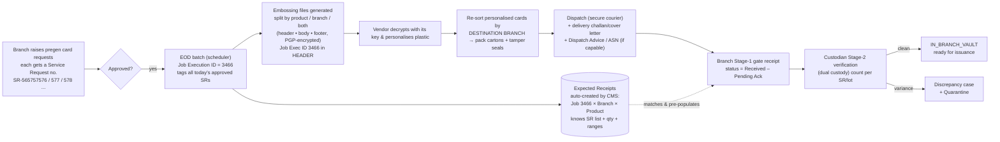

**Key facts captured from the brief**

- A **Service Request (SR)** = one approved card-order request. Many per day.
- The **EOD batch** assigns one **Job Execution ID** (e.g. `3466`) to *all* of that day's approved SRs and writes it into the **header** of every embossing file it produces.
- Embossing files are **split** by `product` / `branch` / `product+branch` per the bank's **split config**, are sectioned **header / body / footer**, and are **PGP-encrypted** with the vendor's key.
- The vendor prints, then **ships cards to each branch**.
- The branch must **receive & acknowledge** card orders arriving via **two mediums**:
  1. **Embossing vendor** (carries **Job Execution ID** + optional shipment details).
  2. **Inter-branch transfer** (from Central Vault / HQ / neighbouring branch), each carrying a **CR — Change Request — number**.
- Receipt is **two-stage**: (1) *Received – Pending Acknowledgement* → (2) *In_Branch_Vault* after custodian count/verification, capturing **discrepancies** (excess / short / tampered / missing / etc.) against each **SR / lot**.

A crucial property I will lean on throughout: **the CMS already owns the `SR → Job → Branch → Product → Qty → serial-range` mapping** the moment the batch runs. The vendor never needs SR numbers. This is the key that unlocks the search/identification problem (Part B).

---

## 2. Part A — Real-world research: how embossing vendors print, pack, dispatch & notify

This section answers each question from the brief with how it actually works at card-personalisation bureaus (IDEMIA, Thales, G+D, Perfect Plastic, etc.), governed by **PCI Card Production & Provisioning** (physical + logical security) and, for India, RBI card-issuance/outsourcing guidance.

### 2.1 The embossing file is a *production input*, not a *shipping unit*

The split config decides how many **data files** the bureau receives and what each contains. But **physical packing & dispatch are always reorganised by destination branch**, because cards must physically arrive at specific branches. A *file* is an accounting/production unit; a *carton to a branch* is the logistics unit. They reconcile on the **dispatch advice / packing list**.

| Split config | Files produced | How the bureau packs & dispatches |
|---|---|---|
| **Branch only** | 1 file per branch (mixed products) | 1 logical consignment per branch; products banded as sub-lots inside the branch carton. Cleanest 1:1 file→branch. |
| **Product only** | 1 file per product, **covering all branches** | Bureau personalises the whole product run, then **sorts by branch** and packs **N branch cartons from the one file**. One file *fans out* to many cartons/branches. |
| **Product + branch** | 1 file per (product × branch) | 1 carton per file — the tidiest mapping; each carton = one file = one (branch, product) lot. |

> **Realistic example.** Bank uses **product+branch** split. Job `3466` produced `EMF-2026-0461` (Pune Camp × DEB-CLS, 750) and `EMF-2026-0462` (Pune Camp × DEB-PLT, 250). The bureau personalises both, packs **CTN-77** (DEB-CLS, 750, seal `SEAL-44821`) and **CTN-78** (DEB-PLT, 250, seal `SEAL-44822`), bands them onto one pallet for Pune Camp, and dispatches both under one AWB.

### 2.2 Packing & the cover letter — **yes, always**

Per PCI Card Production, every secure consignment is **tamper-evident sealed** and accompanied by a **delivery challan / packing list / cover note** (and a chain-of-custody manifest). It typically lists:

- Vendor, dispatch date/time, destination **branch code & address**
- **Courier & AWB / waybill**, number of cartons, total weight
- **Per carton:** carton ID, **tamper-evident seal number**, product, **batch / Job Execution ID reference**, **quantity**, **serial/kit range** (from–to)
- A **declared grand total** the receiver signs against
- Often a **2D barcode / QR** on each carton encoding `{branch, job, carton, seal, qty}` for scan-based receipt

> **Recommendation (carried to Part B & §13):** the bank should *mandate in the vendor SOW* that the **Job Execution ID is printed on the cover letter and carton label**. It is already in the file header the vendor holds, so even a low-tech vendor can do this — and it becomes the reliable receipt key.

### 2.3 Dispatch

Secure logistics: tamper-evident cartons, **bonded / secure courier** (CIT-style for high value), one **AWB per consignment**, often GPS-tracked, **ID-verified handover** at the branch. The PCI Card Production *physical* standard adds explicit secure-transport / chain-of-custody criteria across road, rail, sea and air.

### 2.4 How the vendor notifies the bank — Dispatch Advice / ASN

The standard mechanism is a **Dispatch Advice / Advance Shipping Notice (ASN)** — the retail/manufacturing world's **EDI 856** (EDIFACT equivalent **DESADV**). It is **hierarchical**, which maps perfectly onto card receipt:

```
Shipment (AWB, courier, dispatch date, ETA)
  └─ Order / Job  (Job Execution ID 3466, embossing file ref)
       └─ Pack / Carton  (CTN-77, seal SEAL-44821)
            └─ Item  (product DEB-CLS, qty 750, serial 78112001–78112750)
```

**Should the CMS expose an API for this?** **Yes — but as one of several ingestion modes**, because vendor capability varies:

| Mode | When | Identifier the vendor sends |
|---|---|---|
| **API** `POST /inventory/v1/dispatch-advices` | Mature vendors | Job Exec ID + branch + carton/seal + qty + ranges + AWB |
| **SFTP / EDI 856 / DESADV** file drop | EDI-capable vendors | same, as a structured file |
| **Vendor portal** (manual web form) | Mid-tier vendors | same, keyed by hand |
| **Manual / no ASN** | Low-tech vendors | *nothing electronic* — only the paper challan travels |

**Which unique identifier do they update against?** The **Job Execution ID** (the guaranteed common thread, already in the file header) **+ destination branch + carton/seal**, optionally AWB. **They do NOT reference SR numbers** — SRs are not in a form the vendor tracks per shipment, and the bank doesn't need them to (it resolves SR↔Job internally — see Part B).

### 2.5 How banks accept & verify — realistic example

> **Pune Camp, 19 Jun 2026.** A secure courier delivers 2 sealed cartons for Job `3466`. The **receiving officer (Stage 1)** checks AWB vs challan, counts **2 cartons**, confirms **seals intact**, and signs for a **declared 1,000** cards → system marks both lots **Received – Pending Acknowledgement**. The parcel goes to the **receiving bay (not the vault)**.
> Later, the **custodian + a second officer (Stage 2, dual custody)** open the cartons in the strong-room, scan/count by serial range: **DEB-CLS counts 748 against 750** (2 short), **DEB-PLT = 250 (clean)**. They accept **998 into the vault** (`IN_BRANCH_VAULT`), **quarantine the shortfall**, and raise **discrepancy DISC-2026-0007 (SHORT, 2, SR-565757578)** → vendor claim. The job line for the 2 short cards stays **open**.

### 2.6 Answers to the brief's questions (quick reference)

| # | Question | Answer (short) |
|---|---|---|
| 1 | Print/dispatch when split is product-wise across branches? | File = production unit; bureau **re-sorts by branch** to pack. One product file → N branch cartons. (§2.1) |
| 2 | Is there a cover letter? | **Yes** — delivery challan / packing list + chain-of-custody manifest with carton/seal/qty/range and **Job Exec ID**. (§2.2) |
| 3 | How do they dispatch? | Sealed cartons, secure/bonded courier, AWB, ID-verified handover (PCI Card Production). (§2.3) |
| 4 | How do they update shipment details? | **Dispatch Advice / ASN** — API / SFTP-EDI / portal / manual. (§2.4) |
| 5 | Must CMS expose an API? | **Yes, plus SFTP/portal/manual fallbacks** — vendor capability varies. (§2.4) |
| 6 | Update against which identifier? | **Job Execution ID + branch + carton/seal (+AWB)** — **not** SR. (§2.4, Part B) |
| 7 | How do banks accept & verify? | **Two-stage GRN** under dual custody, 3-way match, discrepancy capture. (§2.5, Part C) |

---

## 3. Part B — The identification problem: how a branch finds the order to receive

This is the brief's central concern: *"1,000 cards arrive — how does the user search which order to mark received?"* and *"job id vs shipment id — but not all banks get shipment updates, and SR is not in the embossing file."*

### 3.1 The insight that resolves it

> **The CMS created the `SR → Job → Branch → Product → Qty → serial-range` map at batch time.** So the system can generate an **Expected Receipt (Inbound Manifest)** *the moment the batch runs* — with **zero vendor input**. The vendor only ever has to quote the **Job Execution ID + branch** (both already on the file header / cover letter).

### 3.2 The "Expected Receipt" object

When Job `3466` runs, CMS auto-creates one Expected Receipt **per (Job × Branch × Product / embossing file)**:

| Field | Example |
|---|---|
| `expectedReceiptId` | `ER-2026-3466-PUN01-CLS` |
| `source` | `VENDOR` |
| `jobExecId` | `3466` |
| `embossingFile` | `EMF-2026-0461` |
| `branch` | `PUN01` (Pune Camp) |
| `product` | `DEB-CLS` |
| `srList` | `SR-565757576 (600)`, `SR-565757578 (150)` |
| `expectedQty` | `750` |
| `serialRange` | `KIT-78112001 – 78112750` |
| `asn` | *(filled later if vendor sends one)* `SHP-2026-0951 / AWB BLR-7781234 / CTN-77 / SEAL-44821` |
| `status` | `AWAITING_DISPATCH → IN_TRANSIT → RECEIVED_PENDING_ACK → IN_BRANCH_VAULT` |

### 3.3 Recommended search/lookup — a tiered key, anchored on Job + Branch

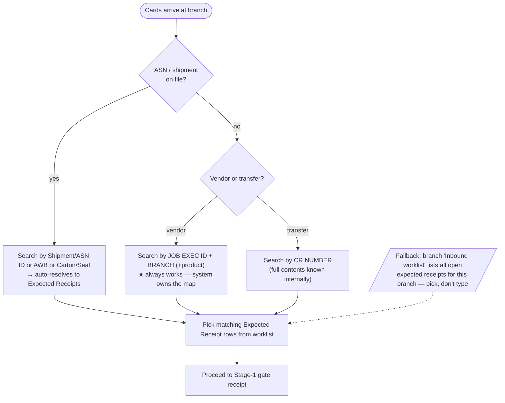

**Decision: primary key = `Job Execution ID + Branch` (optionally + Product).** Rationale:

- **Always available** — the Job Exec ID is the guaranteed common thread (file header → cover letter). Branch is where the cards physically are.
- **Independent of vendor capability** — works even when the bank gets **no ASN** (the system pre-built the expected receipts).
- **Shipment/ASN/AWB/Carton-seal** become *enhanced* keys that **auto-match** to the same expected receipts when present — smoother, scan-friendly, but never *required*.
- **CR number** is the analogous key for transfers.
- **Zero-typing fallback:** the branch's **Inbound Worklist** simply lists every open expected receipt for that branch, so the user can pick rather than search.

> **This directly resolves the brief's dilemma:** banks *with* shipment updates get the richer ASN-driven path; banks *without* still find everything by Job + Branch, because the system — not the vendor — is the source of the expected-receipt data. SR numbers never need to leave the bank.

---

## 4. Part C — Two-stage receipt & acknowledgement flow

### 4.1 Is the proposed two-stage flow standard? **Yes — and it's the right control.**

It matches PCI Card Production dual-control/chain-of-custody and `cardInventoryRequirement.md` §8.4 (two-step acceptance). I propose only refinements (roles, segregation of duties, partial acceptance, quarantine).

```mermaid
sequenceDiagram
  actor V as Vendor / Sender
  actor R as Receiving Officer (Stage 1)
  actor C as Custodian + Checker (Stage 2, dual custody)
  participant S as CMS / CIM
  V->>R: Deliver sealed cartons + challan (Job 3466 / CR-…)
  R->>S: Search Job ID + Branch (or ASN / CR) → Expected Receipt
  S-->>R: Expected qty, cartons, serial ranges
  R->>S: Confirm carton count, seal integrity, declared qty
  S-->>R: status = RECEIVED_PENDING_ACK (parcel → receiving bay)
  Note over C: different person from Stage 1 (SoD)
  C->>S: Open verification under dual custody
  C->>S: Count per SR / lot, 3-way match (expected vs challan vs physical)
  alt all match
    C->>S: Accept clean qty into vault
    S-->>C: status = IN_BRANCH_VAULT (issuable)
  else variance
    C->>S: Record discrepancy (reason, qty, SR/lot, evidence)
    S-->>C: clean qty → vault; variance → QUARANTINED + Discrepancy case
    Note over S: job/SR line stays OPEN for the shortfall
  end
```

### 4.2 Stage definitions

| | **Stage 1 — Gate / mailroom receipt** | **Stage 2 — Custodian vault verification** |
|---|---|---|
| **Who** | Receiving officer | Custodian **+ second officer** (dual custody); **≠ Stage-1 person** (SoD) |
| **Action** | Count cartons, check **seals**, AWB vs challan, sign for **declared qty** | Open cartons, **count cards by serial range per SR/lot**, 3-way match |
| **Granularity** | Carton / consignment level | **SR / lot / serial-range level** |
| **Outcome status** | `RECEIVED_PENDING_ACK` | `IN_BRANCH_VAULT` (clean) · `PARTIALLY_ACCEPTED` · `QUARANTINED` (variance) |
| **Location** | Receiving bay (not vault) | Strong-room / vault |
| **Discrepancies** | Only gross (missing carton, broken seal) | Detailed (short, excess, missing serial, damaged, wrong product…) |

> **Status mapping to the requirements doc:** the brief's `In_Branch_Vault` = doc's `AT_BRANCH` / `IN_VAULT`. I'll use **`IN_BRANCH_VAULT`** in the UI (the user's term) and note the mapping in §K.

### 4.3 Refinements I recommend

1. **Segregation of duties** — Stage-1 receiver cannot be the Stage-2 verifier/checker (system-enforced).
2. **Partial acceptance** — accept the good, quarantine the bad, keep the SR/job line **open** for the shortfall; supports **split shipments** (one job arriving over several days).
3. **"Subject to verification"** — Stage-1 acknowledgement is provisional; a **latent-discrepancy window** lets post-GRN shortages still be claimed against the vendor.
4. **Blind count option** at Stage 2 (hide expected qty from the counter) for high-value lots.
5. **Day-close interaction** — a branch shouldn't day-close with parcels stuck in `RECEIVED_PENDING_ACK` (raise an exception).

---

## 5. Part D — Discrepancy tracking design

The brief: *"we don't have any screen for discrepancies — suggest and implement."*

### 5.1 Approach — a **Discrepancy Register** that feeds the existing Exception engine

Rather than a silo, each discrepancy is a **case** captured at Stage-2, linked to **SR + lot + receipt**, that **auto-creates/links an Exception** (the app already has an Exceptions screen with severity/SLA/escalation). The Discrepancy Register is the *receipt-centric* view; Exceptions remains the *enterprise* view. This reuses existing infrastructure.

### 5.2 Discrepancy record (data model)

| Field | Example |
|---|---|
| `discId` | `DISC-2026-0007` |
| `raisedAt` / `raisedBy` | `19 Jun 2026 14:20 · P. Deshmukh` |
| `source` | `VENDOR` (or `TRANSFER`) |
| `ref` | `Job 3466` (or `CR-2026-0312`) |
| `embossingFile` / `carton` | `EMF-2026-0461` / `CTN-77` |
| `branch` / `product` | `PUN01` / `DEB-CLS` |
| `srNumber` / `lot` | `SR-565757578` / `KIT-78112601–78112750` |
| `reasonCode` | `SHORT` |
| `expectedQty` / `receivedQty` / `varianceQty` | `750 / 748 / −2` |
| `severity` | `High` |
| `status` | `Open → Investigating → Resolved → Closed` |
| `owner` / `slaDueAt` | `Custodian` / `+2 business days` |
| `resolutionCode` | `VENDOR_RESHIP` / `VENDOR_CREDIT` / `WRITE_OFF` / `FOUND_ON_RECOUNT` / `ACCEPTED_DEVIATION` |
| `linkedExceptionId` | `EXC-2026-4471` |
| `evidence` / `notes` | seal photo ref, CCTV ref, vendor email |

### 5.3 Standard reason codes

`SHORT` · `EXCESS` · `TAMPERED_SEAL` · `TAMPERED_ENVELOPE` · `CARD_MISSING` (specific serial) · `DAMAGED` · `MISPRINT` · `WRONG_PRODUCT` · `WRONG_BRANCH` · `SERIAL_MISMATCH` · `DUPLICATE_SERIAL` · `MISSING_PIN_MAILER` · `LATE_DELIVERY` · `ASN_MISMATCH`.

### 5.4 Discrepancy lifecycle

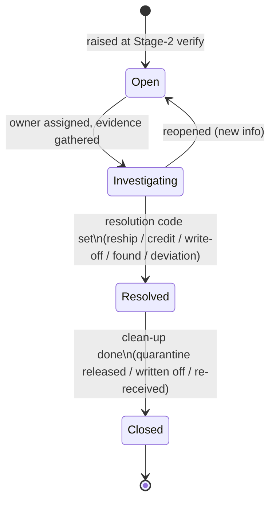

> **Example.** `DISC-2026-0007` (SHORT 2, SR-565757578) opens as **High**, links `EXC-2026-4471`, owner = custodian, SLA 2 days. Vendor confirms a pick-pack miss → **VENDOR_RESHIP**; 2 cards arrive next cycle as a tiny new receipt; on acceptance the case → **Closed**, the SR line balances.

---

## 6. Part E — Inter-branch transfer receipt (CR number) & gap analysis

### 6.1 Flow (mirrors the vendor flow; **easier**, because the system fully owns the contents)

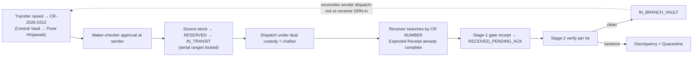

### 6.2 Gaps I see in the CR flow (and fixes)

| Gap | Risk | Fix |
|---|---|---|
| **Source not decremented on dispatch** | Same stock issued twice (sender + receiver) | On CR approve/dispatch, move source stock to `RESERVED`→`IN_TRANSIT`; receiver GRN moves it to their `IN_BRANCH_VAULT`. **Conservation of serials** end-to-end. |
| **No two-sided reconciliation** | "Dispatched but never received" goes unnoticed | Link sender **dispatch-out** to receiver **GRN-in**; **in-transit-overdue** escalation if not received by ETA (app already has In-transit + overdue). |
| **CR carries qty only, not serial ranges** | Can't trace which kits moved | CR **must carry serial/kit ranges** (internal transfer → fully known). Receipt verifies by range. |
| **Mixed provenance** | A neighbour-branch transfer may bundle leftover vendor stock | Preserve **per-lot provenance** (which job/CR each lot came from) so trace/aging survive the hop. |
| **Status divergence** | Two different receipt UIs for vendor vs transfer | **Unify** both under one Inbound model with a `source` discriminator (`VENDOR` | `TRANSFER`) and the *same* two statuses. One worklist, one Stage-1/Stage-2, one discrepancy register. |
| **PIN mailer separation** | If personalised stock transfers, card+PIN could travel together | Keep PIN-mailer separation rule (usually pregen transfers carry no PIN; flag if they do). |

**Verdict:** the CR flow is sound and, because contents are internally known, the receipt is actually *simpler* than the vendor case. The main work is **stock conservation at the source** and **unifying the UI** with the vendor path.

---

## 7. Part F — UX design: screens, submenus, wireframes

### 7.1 Information architecture

Rename the existing **"Receive (GRN)"** nav item to **"Receipt & Acknowledgement"**, with **internal tabs** (the app already uses tabs in *Branch & product stats*, and modals in *Collection* / *Custodian* — I'll follow those patterns):

```
Receipt & Acknowledgement   (sidebar item; badge = count Pending-Ack)
├─ Tab 1: Inbound worklist      ← search + pick (default)
├─ Tab 2: Discrepancies         ← register + case detail
└─ Tab 3: Completed GRNs        ← acknowledgement document archive
   Actions launched from a worklist row:
     • Stage-1 gate receipt   (drawer/modal)
     • Stage-2 vault verify   (full-width panel)
```

### 7.2 Wireframe — **Tab 1: Inbound worklist** (search + pick hub)

```
┌ Receipt & Acknowledgement ─────────────────────────────────────────────────┐
│ [ Inbound worklist ] [ Discrepancies ] [ Completed GRNs ]                    │
│                                                                              │
│ Source: (•) All ( ) Vendor ( ) Transfer    Branch: [Pune Camp ▼]            │
│ Search: [ Job 3466 / ASN / CR / AWB …          🔍 ]   Status: [All ▼]       │
│                                                                              │
│ ┌──────────────────────────────────────────────────────────────────────┐  │
│ │ Ref          Source   Product  Exp.Qty  Serial range        Status     │  │
│ │ Job 3466     Vendor   DEB-CLS    750     78112001–78112750   ● In transit│ │
│ │ Job 3466     Vendor   DEB-PLT    250     78120001–78120250   ● In transit│ │
│ │ CR-2026-0312 Transfer DEB-CLS    300     90011–90310         ● Pending Ack│ │  ← [Verify →]
│ │ Job 3460     Vendor   PPD-GFT    400     61500–61899         ● In Vault ✓ │ │
│ └──────────────────────────────────────────────────────────────────────┘  │
│  Inbound today: 4 docs (1,700 cards) · Pending Ack: 1 · Awaiting verify: 1  │
└──────────────────────────────────────────────────────────────────────────┘
   row action by status:  In transit → [Receive] · Pending Ack → [Verify] · In Vault → [GRN]
```

### 7.3 Wireframe — **Stage-1 gate receipt** (drawer)

```
┌ Stage 1 · Gate receipt — Job 3466 · Pune Camp ─────────────────────────┐
│ Expected: 2 cartons · 1,000 cards (DEB-CLS 750, DEB-PLT 250)            │
│ Cover letter / challan no.: [ DC-77231        ]   AWB: [ BLR-7781234 ] │
│ Cartons received:  [ 2 ]   Seals intact?  (•) Yes ( ) No → reason ___  │
│ Declared qty on challan: [ 1000 ]                                      │
│ Received by: P. Deshmukh (auto)   Time: 19 Jun 2026 11:05 (auto)       │
│                                                                        │
│ ⚠ Gate-level issue? [+ Missing carton] [+ Broken seal] [+ Wrong branch]│
│                                                                        │
│           [ Cancel ]                 [ Confirm receipt → Pending Ack ] │
└────────────────────────────────────────────────────────────────────────┘
```

### 7.4 Wireframe — **Stage-2 custodian verification** (per-SR/lot count + discrepancy)

```
┌ Stage 2 · Vault verification (dual custody) — Job 3466 · Pune Camp ─────────┐
│ Custodian: P. Deshmukh    Joint officer: B. Patil    [☐ Blind count]        │
│                                                                             │
│ ┌ SR / lot table ──────────────────────────────────────────────────────┐  │
│ │ SR             Product  Serial range        Exp.  Counted  Δ   Reason   │ │
│ │ SR-565757576   DEB-CLS  78112001–78112600   600   [600]    0   —        │ │
│ │ SR-565757578   DEB-CLS  78112601–78112750   150   [148]   −2   [SHORT▼] │ │
│ │ SR-565757577   DEB-PLT  78120001–78120250   250   [250]    0   —        │ │
│ └────────────────────────────────────────────────────────────────────────┘│
│ Clean to vault: 998   Quarantine: 2   Discrepancies: 1                     │
│ Checker sign-off: [ B. Patil ▼ ]  (must differ from receiver)              │
│                                                                             │
│        [ Save draft ]        [ Raise discrepancy ]   [ Accept → In Vault ] │
└─────────────────────────────────────────────────────────────────────────────┘
```

### 7.5 Wireframe — **Tab 2: Discrepancy register**

```
┌ Discrepancies ──────────────────────────────────────────────────────────────┐
│ Filter: [Open ▼]  Source:[All ▼]  Reason:[All ▼]   Linked exceptions: 3      │
│ ┌────────────────────────────────────────────────────────────────────────┐ │
│ │ ID            Ref     SR/Lot          Reason   Δ    Sev   Status    SLA  │ │
│ │ DISC-2026-0007 Job3466 SR-565757578   SHORT    −2   High  Open      1d   │ │
│ │ DISC-2026-0006 CR-0312 CTN-91         TAMPERED  —   High  Investig. 4h   │ │
│ │ DISC-2026-0005 Job3460 SR-565700912   EXCESS   +5   Med   Resolved  —    │ │
│ └────────────────────────────────────────────────────────────────────────┘ │
│ ▸ click a row → detail drawer: timeline, evidence, resolution, linked EXC   │
└───────────────────────────────────────────────────────────────────────────────┘
```

### 7.6 Component breakdown (React, matching existing conventions)

- `ReceiptAck` (new top-level view; replaces/absorbs `Receiving`) — holds the 3 tabs + worklist state.
- `InboundWorklist`, `Stage1ReceiptDrawer`, `Stage2VerifyPanel`, `DiscrepancyRegister`, `DiscrepancyDetailDrawer`, `GrnDocument`.
- Reuse primitives: `Card`, `Kpi`, `Badge`, `SectionTitle`, `Th`, `Td`; reuse `addException`/`toast`; reuse `Cell`/charts if a small "inbound by status" donut is wanted.
- All in `CardInventoryDemo.jsx` (consistent with the single-file pattern) or a new `src/components/ReceiptAck.jsx` if we want to start modularising (decision for review — see §13).

---

## 8. Part G — Data model & dummy data

### 8.1 New constants (deterministic, in-memory — same style as existing demo data)

```text
EMBOSSING_JOBS = [
  { jobExecId:"3466", runDate:"16 Jun 2026", vendor:"SecurePrint Card Co.",
    split:"product+branch", files:["EMF-2026-0461","EMF-2026-0462", ...] }
]

SERVICE_REQUESTS = [
  { sr:"SR-565757576", branch:"PUN01", product:"DEB-CLS", qty:600, jobExecId:"3466",
    file:"EMF-2026-0461", serialFrom:"KIT-78112001", serialTo:"KIT-78112600", status:"IN_TRANSIT" },
  { sr:"SR-565757578", branch:"PUN01", product:"DEB-CLS", qty:150, jobExecId:"3466",
    file:"EMF-2026-0461", serialFrom:"KIT-78112601", serialTo:"KIT-78112750", status:"IN_TRANSIT" },
  { sr:"SR-565757577", branch:"PUN01", product:"DEB-PLT", qty:250, jobExecId:"3466",
    file:"EMF-2026-0462", serialFrom:"KIT-78120001", serialTo:"KIT-78120250", status:"IN_TRANSIT" },
  ... (more SRs for other branches under the same job)
]

EXPECTED_RECEIPTS = [
  { id:"ER-3466-PUN01-CLS", source:"VENDOR", jobExecId:"3466", file:"EMF-2026-0461",
    branch:"PUN01", product:"DEB-CLS", srList:["SR-565757576","SR-565757578"],
    expectedQty:750, serialRange:"KIT-78112001–78112750",
    asn:{ shipment:"SHP-2026-0951", awb:"BLR-7781234", carton:"CTN-77", seal:"SEAL-44821",
          courier:"SecureLogistics", dispatched:"17 Jun", eta:"19 Jun" },
    status:"IN_TRANSIT" },
  { id:"ER-3466-PUN01-PLT", source:"VENDOR", jobExecId:"3466", file:"EMF-2026-0462",
    branch:"PUN01", product:"DEB-PLT", srList:["SR-565757577"], expectedQty:250,
    serialRange:"KIT-78120001–78120250",
    asn:{ ...CTN-78 / SEAL-44822... }, status:"IN_TRANSIT" },
  { id:"ER-CR0312-PUN02-CLS", source:"TRANSFER", crNumber:"CR-2026-0312",
    from:"Central Vault", branch:"PUN02", product:"DEB-CLS", expectedQty:300,
    serialRange:"KIT-90011–90310", status:"RECEIVED_PENDING_ACK" },
]

DISCREPANCY_REASONS = ["SHORT","EXCESS","TAMPERED_SEAL","CARD_MISSING","DAMAGED",
  "MISPRINT","WRONG_PRODUCT","WRONG_BRANCH","SERIAL_MISMATCH","DUPLICATE_SERIAL",
  "MISSING_PIN_MAILER","LATE_DELIVERY","ASN_MISMATCH"]

INITIAL_DISCREPANCIES = [
  { discId:"DISC-2026-0007", source:"VENDOR", ref:"3466", file:"EMF-2026-0461",
    branch:"PUN01", product:"DEB-CLS", sr:"SR-565757578", lot:"KIT-78112601–78112750",
    reason:"SHORT", expected:750, received:748, variance:-2, severity:"High",
    status:"Open", owner:"Custodian", sla:"2 business days", linkedException:"EXC-2026-4471" },
  { discId:"DISC-2026-0006", source:"TRANSFER", ref:"CR-2026-0312", branch:"PUN02",
    product:"DEB-CLS", lot:"CTN-91", reason:"TAMPERED_SEAL", severity:"High",
    status:"Investigating", owner:"BM", sla:"4 hours", linkedException:"EXC-2026-4469" },
]
```

### 8.2 Reuse / extend existing demo data
- Extend `INITIAL_GRNS` → the new `EXPECTED_RECEIPTS` + `RECEIPTS` model (keep current GRN cards working).
- Reuse `INITIAL_TRANSFERS` + `INITIAL_SHIPMENTS` for the CR/ASN linkage.
- New discrepancies feed the existing `exceptions` state via `addException`.

---

## 9. Part H — Edge cases (must-handle)

| # | Edge case | Handling |
|---|---|---|
| 1 | **Split shipment** — one job arrives over several days | Partial acceptance; SR/job line stays open; each delivery is its own receipt against the same expected record |
| 2 | **Short / excess** | Discrepancy SHORT/EXCESS; accept matched qty, quarantine variance |
| 3 | **Tampered seal / envelope** | Stage-1 can flag; force Stage-2 full count; high-severity case |
| 4 | **Specific card missing (middle of range)** | CARD_MISSING with the exact serial; range split + lineage preserved |
| 5 | **Wrong branch delivery** | WRONG_BRANCH; reroute / inter-branch transfer to correct branch; don't vault |
| 6 | **Wrong product / misprint / damaged** | Respective reason; quarantine; vendor reship/credit |
| 7 | **Duplicate / mismatched serial** | DUPLICATE_SERIAL / SERIAL_MISMATCH; block from vault; investigate |
| 8 | **No ASN (low-tech vendor)** | Search by Job + Branch; expected receipt already exists |
| 9 | **ASN mismatch vs physical / challan** | ASN_MISMATCH; physical+challan is source of truth, ASN flagged |
| 10 | **Vendor quoted wrong Job ID** | Worklist fallback (browse branch inbound) + manual link to correct expected receipt |
| 11 | **One carton → multiple jobs / one job → multiple cartons** | Carton↔job is many-to-many; receipt operates at expected-receipt (job×branch×product) grain, cartons are evidence |
| 12 | **Receipt while day closed** | Allow gate receipt; block vault posting if day-close rules require, or raise exception |
| 13 | **Receiver = verifier (SoD breach)** | System blocks; checker must differ |
| 14 | **PIN mailer (personalised)** | Separate consignment, separate count, MISSING_PIN_MAILER reason; never co-located with cards |
| 15 | **In-transit overdue** | Escalation exception before receipt even happens (links to In-transit screen) |
| 16 | **Re-open after partial** | Shortfall remains open; later delivery closes it |

---

## 10. Part I — Status / state machine (receipt sub-states)

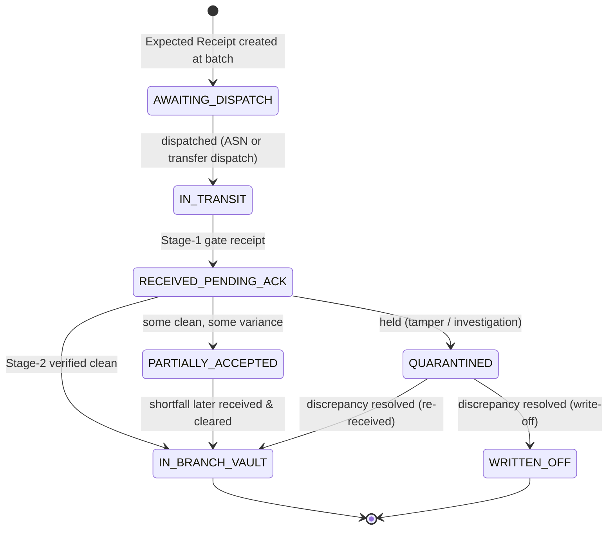

Aligns with `cardInventoryRequirement.md` §6 (`RECEIVED_PENDING_ACK` → `AT_BRANCH/IN_VAULT`; `QUARANTINED`/`BLOCKED`).

---

## 11. Part J — Implementation plan (phased — to start after your review)

| Phase | Scope | Files |
|---|---|---|
| **J1 — Data** | Add `EMBOSSING_JOBS`, `SERVICE_REQUESTS`, `EXPECTED_RECEIPTS`, `DISCREPANCY_REASONS`, `INITIAL_DISCREPANCIES`; helpers `expectedFor(branch)`, `resolveSRs(jobExecId,branch)` | `CardInventoryDemo.jsx` (or new `src/lib/receipts.js` for pure helpers) |
| **J2 — Worklist + search** | `ReceiptAck` view with tabs; `InboundWorklist` with tiered search (Job+Branch / ASN / CR) + status badges | `CardInventoryDemo.jsx` |
| **J3 — Stage 1** | `Stage1ReceiptDrawer`: carton/seal/declared-qty, → `RECEIVED_PENDING_ACK`; gate-level issues | same |
| **J4 — Stage 2** | `Stage2VerifyPanel`: per-SR/lot count, 3-way match, SoD checker, partial accept, → `IN_BRANCH_VAULT`/quarantine | same |
| **J5 — Discrepancies** | `DiscrepancyRegister` + detail drawer; auto-link `addException`; lifecycle | same |
| **J6 — Transfers (CR)** | Unify CR receipts into the same worklist/stages; source reservation note | same + `Transfers` |
| **J7 — Nav + polish** | Rename nav item, badges (Pending-Ack / discrepancy counts), toasts, KPIs, completed-GRN archive | nav array |
| **J8 — Docs** | Update `cardInventoryRequirement.md` (see §K) once implemented | `cardInventoryRequirement.md` |

> Decision for review: keep everything in the single `CardInventoryDemo.jsx` (current convention) **or** begin extracting `ReceiptAck` into `src/components/` + `src/lib/receipts.js`. My recommendation in §13.

---

## 12. Part K — Alignment with the requirements doc

| Brief term | Requirements-doc term | Action |
|---|---|---|
| Service Request (SR) | (new) order-request grain under order line | Add SR to §5 identifier hierarchy |
| Job Execution ID | Batch run / (new) | Add as the receipt anchor key in §5/§8.4 |
| Embossing file (header/body/footer, PGP) | EMF (§5) | Note sections + encryption |
| `Received – Pending Ack` → `In_Branch_Vault` | §6 `RECEIVED_PENDING_ACK` → `AT_BRANCH/IN_VAULT` | Map terms; keep both |
| CR number (transfer) | TransferOrder (§11 Flow K) | Add CR as the transfer-receipt key |
| Discrepancy register | §8.4 discrepancy + §11 Flow H | New screen realises existing requirement |

**Proposed doc updates (after build):** expand **§8.4** with the two-stage R&A + Expected-Receipt concept; add **SR / Job Exec ID / CR** to **§5**; add a **Flow R — Receipt & acknowledgement (vendor + transfer)**; bump to **v2.3**; add a revision-history row. (Consistent with the "update doc once implementation done" pattern.)

---

## 13. Part L — Personalised card acknowledgement (same menu, card-by-card)

> **Scope add (v0.3).** Personalised cards now share the **same Receipt & Acknowledgement menu**, Expected-Receipt model, tiered search (Job + Branch), two-stage flow, and discrepancy register as pregen. This Part specifies only what *differs*. It grounds in `cardInventoryRequirement.md` §9 (pregen vs personalised), §10 (PIN mailer), and §11 Flow F (collection last-mile).

### L.0 Playback — personalised is procedurally identical up to dispatch

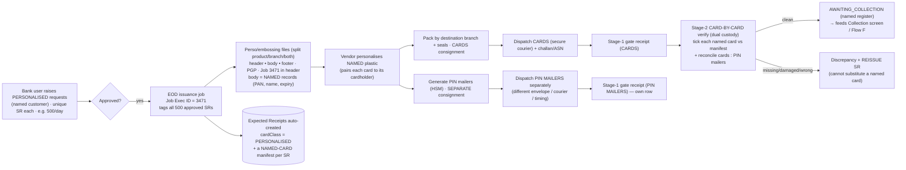

### L.1 What's the same vs what differs

| Aspect | Pregen (built) | **Personalised (this Part)** |
|---|---|---|
| SR → Job → embossing split | same | **same** |
| Menu, worklist, Job+Branch search | same | **same** (a `cardClass` flag distinguishes) |
| Stage-1 gate receipt | same | **same** — plus a **separate PIN-mailer consignment** row |
| Stage-2 verification grain | per-SR **range + count** | **card-by-card** — tick every **named** card (PAN / cardID / customer) vs manifest |
| Shortfall handling | accept matched, quarantine rest (fungible) | **no substitution** — a missing/damaged named card forces a **reissue SR** for that customer |
| Accepted into | `IN_BRANCH_VAULT` (issuable pool) | **`AWAITING_COLLECTION`** (named register → Collection screen); not general issuance |
| PIN | inside kit, inactive | **separate consignment**, separately reconciled (or **Green PIN** = none) |
| Replenishment / forecast | yes | **no** (never reorder a customer's card) |
| Discrepancy register | shared | **shared** + personalised-specific reasons |

### L.2 Two-stage flow for personalised (sequence)

```mermaid
sequenceDiagram
  actor V as Vendor
  actor R as Receiving officer (Stage 1)
  actor C as Custodian + Checker (Stage 2)
  participant S as CMS / CIM
  V->>R: Deliver CARDS carton + challan (Job 3471); SEPARATELY the PIN-mailer consignment
  R->>S: Search Job 3471 + Branch → personalised Expected Receipt (+ PIN companion)
  R->>S: Gate-receive CARDS (cartons, seals, declared count)
  R->>S: Gate-receive PIN MAILERS (separate row, separate custody)
  S-->>R: both → RECEIVED_PENDING_ACK
  Note over C: dual custody · SoD (≠ Stage-1)
  C->>S: Card-by-card — tick each named card present / mark missing|damaged|wrong-customer
  C->>S: Reconcile cards count : PIN-mailer count
  alt every named card present & paired
    C->>S: Accept → AWAITING_COLLECTION (named register)
    S-->>C: cards enter Collection lifecycle (aging clock starts)
  else some named card missing / damaged / wrong
    C->>S: Raise discrepancy per card + auto-raise REISSUE SR for that customer
    S-->>C: present cards → AWAITING_COLLECTION; problem cards → Quarantine / Reissue
  end
```

### L.3 PIN mailer — parallel, separate-custody reconciliation

Real-world standard: the **card carrier and PIN mailer are posted as two separate consignments** so intercepting one is useless — increasingly replaced by **Green PIN** (ATM / IVR / app), in which case there is **no mailer stream**.

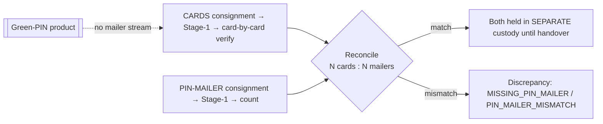

Rules: never co-locate card + PIN before customer handover (raise **CARD_PIN_TOGETHER** if a consignment violates this); green-PIN products skip the mailer entirely; the PIN mailer **never gates** the card's entry to `AWAITING_COLLECTION` — it gates *handover*, which lives in the Collection screen.

### L.4 Wireframe — Stage-2 personalised card-by-card verification

```
┌ Stage 2 · Personalised verification (dual custody) — Job 3471 · Pune Camp ──────┐
│ Custodian: P. Deshmukh   Checker: B. Patil   [☐ Blind]   Cards 180 · Mailers 180│
│ Quick: [✓ Mark all present]   then flag exceptions ↓                            │
│ ┌────────────────────────────────────────────────────────────────────────────┐│
│ │ Card ID         Masked PAN          Customer    SR             Status        ││
│ │ CRD-2026-119004 ****-****-****-1234 A. Rao      SR-700004501   (•) Present   ││
│ │ CRD-2026-119005 ****-****-****-1190 M. Khan     SR-700004502   ( ) Missing ▼ ││
│ │ CRD-2026-119006 ****-****-****-2231 S. Gupta    SR-700004503   ( ) Damaged ▼ ││
│ │ … 177 more …                                                                 ││
│ └────────────────────────────────────────────────────────────────────────────┘│
│ PIN mailers: expected 180 · received [ 179 ]  Δ −1 → MISSING_PIN_MAILER         │
│ Present → collection: 178   Reissue: 2   PIN short: 1                           │
│      [ Save draft ]     [ Raise discrepancies + reissue ]    [ Accept present ] │
└─────────────────────────────────────────────────────────────────────────────────┘
```

### L.5 Outcome & linkage to the Collection register

Accepted named cards **do not enter the issuable vault**. Each becomes a `CollectionRecord` in `AWAITING_COLLECTION` (the app's existing **Card collection** screen / Flow F): aging clock starts, reminders at 15/30/45 days, KYC handover → `COLLECTED`, or unclaimed > 60 days → blocked → destroyed. R&A hands off; Collection owns the last mile.

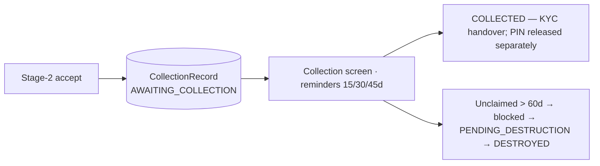

### L.6 Personalised-specific discrepancy reasons (extend the shared register)

`CARD_MISSING_NAMED` (a specific customer's card absent → reissue) · `WRONG_CUSTOMER` / `NAME_PAN_MISMATCH` (card personalised wrong → reissue) · `DAMAGED_PERSONALISED` (→ reissue; no substitution) · `KYC_DATA_MISMATCH` · `MISSING_PIN_MAILER` · `PIN_MAILER_MISMATCH` · `CARD_PIN_TOGETHER` (control breach) · `SR_CANCELLED_CARD_PRINTED` (account closed before receipt → divert to destruction). Every missing / damaged / wrong named card **auto-raises a reissue SR** (a fresh request to issuance), linked to both the discrepancy and the original SR.

### L.7 Edge cases (personalised-specific)

| # | Edge case | Handling |
|---|---|---|
| 1 | A named customer's card missing | `CARD_MISSING_NAMED` → reissue SR; the rest proceed to collection |
| 2 | Card personalised for wrong customer / name ≠ PAN | `WRONG_CUSTOMER` / `NAME_PAN_MISMATCH` → quarantine + reissue; never hand over |
| 3 | Damaged named card | `DAMAGED_PERSONALISED` → reissue (cannot substitute from a pool) |
| 4 | PIN mailer late / never arrives | Cards still → `AWAITING_COLLECTION`; `MISSING_PIN_MAILER`; **handover blocked** until PIN resolved (or Green PIN) |
| 5 | Card + PIN in the same consignment | `CARD_PIN_TOGETHER` control breach → escalate, segregate immediately |
| 6 | Orphan PIN mailer (no matching card) or orphan card | flagged in both directions during reconciliation |
| 7 | Customer relocated branch before receipt | accept, then **transfer** the `AWAITING_COLLECTION` card to the new home branch (CR) |
| 8 | SR cancelled / account closed but card already printed | `SR_CANCELLED_CARD_PRINTED` → receive, divert straight to destruction (unclaimed path) |
| 9 | Green-PIN product | no PIN stream; reconciliation skips mailers |
| 10 | Split delivery of a 500-card job | partial card-by-card accept; remaining named cards stay open against the same Expected Receipt |
| 11 | Excess named card not on the manifest | investigate (likely wrong branch) — never auto-accept a name you didn't expect |

### L.8 State-machine delta (personalised tail)

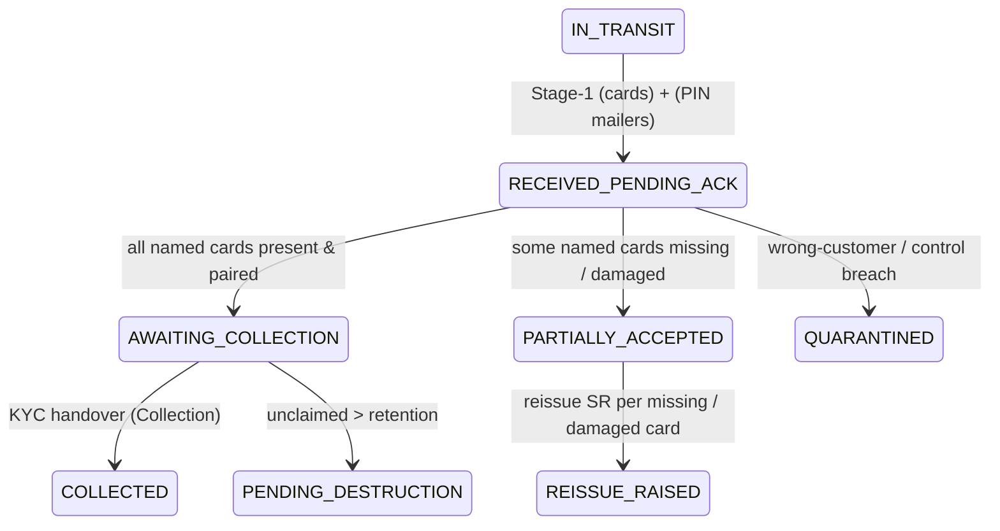

(Pregen ends at `IN_BRANCH_VAULT`; personalised ends at `AWAITING_COLLECTION` → Collection lifecycle.)

### L.9 UX integration — same menu, one discriminator

- **`cardClass` on the Expected Receipt** (`PREGEN` | `PERSONALISED`), derived from product `cls` (`DEB-PRS` etc. = Personalised).
- **Worklist:** add a **Class** column + filter (All / Pregen / Personalised); personalised rows badged; the **PIN-mailer companion** shows as a linked row.
- **Stage-1:** identical; the PIN-mailer consignment is a separate receipt row.
- **Stage-2:** the component **branches on `cardClass`** — pregen → the count grid (built); personalised → the **card-by-card panel** (L.4) + PIN reconcile strip.
- **Accept:** pregen → vault; personalised → **create CollectionRecords** (`AWAITING_COLLECTION`) and, for exceptions, **reissue SRs**.
- Everything else — search, discrepancy register, statuses, SoD, blind-count, badges — is **reused unchanged**.

### L.10 Dummy data to add (deterministic, in-memory)

```text
EMBOSSING_JOBS += { jobExecId:"3471", runDate:"26 Jun 2026", vendor:"SecurePrint Card Co.",
                    split:"product+branch", files:["EMF-2026-0480"], cardClass:"PERSONALISED" }

SERVICE_REQUESTS += (personalised — one per named customer)
  { sr:"SR-700004501", branch:"PUN01", product:"DEB-PRS", qty:1, jobExecId:"3471",
    file:"EMF-2026-0480", customer:"A. Rao",  cardId:"CRD-2026-119004", pan:"****-****-****-1234" }
  { sr:"SR-700004502", …, customer:"M. Khan", cardId:"CRD-2026-119005", pan:"****-****-****-1190" }
  … 180 named SRs for Pune Camp …

EXPECTED_RECEIPTS +=
  { id:"ER-3471-PUN01-PRS", source:"VENDOR", cardClass:"PERSONALISED", jobExecId:"3471",
    file:"EMF-2026-0480", branch:"PUN01", product:"DEB-PRS", expectedQty:180,
    namedCards:[ {cardId, pan, customer, sr}, … 180 … ],
    pinConsignment:{ id:"SHP-2026-0962-PIN", expectedMailers:180, status:"IN_TRANSIT" },
    asn:{ shipment:"SHP-2026-0962", awb:"BLR-7785512", carton:"CTN-93", seal:"SEAL-93", … },
    status:"IN_TRANSIT" }

INITIAL_DISCREPANCIES +=
  { discId:"DISC-2026-0008", source:"VENDOR", cardClass:"PERSONALISED", ref:"3471",
    branch:"PUN01", product:"DEB-PRS", sr:"SR-700004502", lot:"CRD-2026-119005",
    reason:"CARD_MISSING_NAMED", expected:1, received:0, variance:-1, sev:"High",
    status:"Open", owner:"Custodian", reissueSr:"SR-700004599", linkedException:"EXC-2026-4473",
    note:"Named card for M. Khan absent → reissue SR-700004599 raised." }
```

> **Worked example.** Job `3471` → Pune Camp: **180 named DEB-PRS cards + 180 PIN mailers** (separate consignment). Stage-2 card-by-card: **178 present**, M. Khan's card **missing** (→ reissue `SR-700004599`), S. Gupta's card **damaged** (→ reissue); **PIN mailers 179 vs 180** (−1, `MISSING_PIN_MAILER`). Result: **178 clean cards → `AWAITING_COLLECTION`** (Collection screen, aging starts); **2 reissue SRs** raised; **1 PIN short** logged. The Job 3471 line stays **open** for the 2 reissues.

### L.11 Build phase (after your review)

Extends the **same** `ReceiptAck` (no new nav): add `cardClass` + `namedCards` + `pinConsignment` to `src/lib/receipts.js`; add a `PersonalisedVerify` panel in `ReceiptAck.jsx` that the Stage-2 modal renders when `cardClass === "PERSONALISED"`; on accept, push `CollectionRecord`s (reuse the app's `setCollection`) and raise reissue SRs; add the personalised reasons to the discrepancy register. Personalised stays **out of replenishment/forecast**.

---

## 14. Part M — Branch Transfer Order (request → allocate → dispatch)

> **Scope.** This Part designs the **outbound** half of inter-branch transfer — *raise a request, approve, allocate stock from lots, approve dispatch, and ship*. The **inbound** half (receipt by **CR number**) is already built (Part E + the Receipt & Acknowledgement screen). Together they are the **two ends of one CR**. Grounded in the standard **3-leg inter-branch transfer** (Requisition → IBT-Out → IBT-In) and the **two-step stock-transport-order** (reserve → goods-issue / in-transit → goods-receipt). Relates to `cardInventoryRequirement.md` §8.5 and §11 Flow K.

### M.0 Playback — two modes, two request types

- **Mode 1 — HQ / Central / Card-Center → branches** (one source serves many).
- **Mode 2 — Branch ↔ branch** (any branch holding stock can fulfil another's request).
- **Request types:**
  - **Request Cards** *(pull — branch-initiated)*: a branch asks for stock; a fulfiller allocates and ships.
  - **Transfer Cards** *(push — HQ/source-initiated)*: HQ/Central decides to send stock directly to a branch.

Both produce a **CR (Change Request)** that flows the **same** lifecycle and is received via Receipt & Acknowledgement.

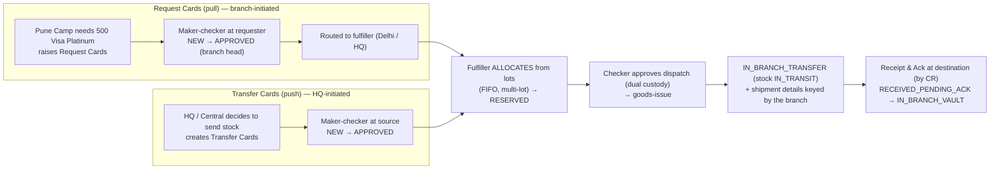

### M.1 The 3 legs (how it maps to our model)

| Leg | Who | What | Screen |
|---|---|---|---|
| **Requisition** | requesting branch | *Request Cards* (NEW → APPROVED) | **Branch Transfer Order** (new) |
| **IBT-Out** | fulfilling branch / HQ | allocate from lots + approve + dispatch | **Branch Transfer Order** (new) |
| **IBT-In** | receiving branch | gate + card/lot verify | **Receipt & Acknowledgement** (built) |

### M.2 Your questions, answered

**Q1 — Do we need an approver at the fulfilment side too?** **Yes — maker-checker at *both* ends, plus dual custody on the vault-out.**
- *Requester side:* maker raises the request → branch head (checker) approves. `NEW → APPROVED`. ✅ (as you described)
- *Fulfiller side:* a vault officer (maker) **allocates** the lots → a **second officer / branch head (checker) approves the dispatch** under **dual custody**. Dispatching stock *out* of a vault is a high-value, irreversible movement — a second pair of eyes must verify the pick (right serials, right qty) before goods-issue. This prevents wrong/over-allocation and fraud, and matches PCI Card Production dual-custody for outward movements.

**Q2 — Do branches update shipment details? How?** **Yes — and always.** Unlike the embossing vendor (external, capability varies), the dispatching **branch is an internal CMS user**, so it keys the shipment details **directly in the Transfer Order → Dispatch screen**: courier, AWB, carton/seal, dispatch date, ETA, and the allocated **serial ranges**. This is the *internal equivalent of the vendor ASN* — but it's **always present** (no API/portal needed). That's exactly why transfer receipts are richer and easier than vendor receipts (Part E).

**Q3 — Do I need to change the card status from "In Transit"?** Think in **two layers** — they're two views of the same fact, and you should keep them aligned:

| Layer | States |
|---|---|
| **Transfer-order (CR) document** | `NEW → APPROVED → ALLOCATED → READY_FOR_DISPATCH → IN_BRANCH_TRANSFER → RECEIVED_PENDING_ACK → IN_BRANCH_VAULT` |
| **Stock unit (the physical cards)** | `IN_VAULT → RESERVED → IN_TRANSIT → RECEIVED_PENDING_ACK → IN_BRANCH_VAULT` |

So: you **don't need a third card state** — `IN_BRANCH_TRANSFER` (document) corresponds to the stock units being `IN_TRANSIT`. What you **do** need to add is **`RESERVED` at allocation** and a **source decrement at dispatch** (goods-issue): once dispatched, the cards leave the fulfiller's *available* balance and exist only as in-transit until the destination's GRN re-creates them. That conservation is the missing piece in the current flow.

**Q4 — Current flow & improvements:** see M.4.

### M.3 Allocation from lots — the new core UX

The fulfiller opens an approved request and **searches its own stock by product**; the system lists **available lots** (each lot = **Job ID + SR + serial range + on-hand qty**, FIFO-ordered by receipt date). The user allocates **across one or more lots** until the requested quantity is met (FIFO suggested, override logged). The allocation produces the CR's **serial ranges** and **reserves** them.

```
┌ Allocate — CR-2026-0501 · 500 Visa Platinum → Pune Camp ───────────────────────┐
│ Fulfiller: Delhi Connaught Pl.   Requested: 500   Allocated: 500   Short: 0     │
│ FIFO suggestion: ON ✓   (manual override is logged)                             │
│ ┌────────────────────────────────────────────────────────────────────────────┐│
│ │ Lot    Job ID  SR            Serial range       Recd    Avail   Allocate     ││
│ │ Lot A  3201    SR-560011001  KIT-90001–90250    02 May   250    [ 250 ]      ││
│ │ Lot B  3266    SR-560022040  KIT-91000–91399    20 May   400    [ 250 ]      ││
│ │ Lot C  3299    SR-560033075  KIT-92000–92099    05 Jun   100    [   0 ]      ││
│ └────────────────────────────────────────────────────────────────────────────┘│
│ Allocated ranges: KIT-90001–90250 (250)  +  KIT-91000–91249 (250)               │
│        [ Cancel ]              [ Reserve & send for dispatch approval → ]        │
└──────────────────────────────────────────────────────────────────────────────────┘
```

### M.4 Improved lifecycle (vs your current flow)

**Your current flow:** `IN_CENTRAL_VAULT → IN_BRANCH_TRANSFER → RECEIVED_PENDING_ACK → IN_BRANCH_VAULT`

**Improvements (what to add and why):**

| Improvement | Why |
|---|---|
| Insert **NEW → APPROVED → ALLOCATED → READY_FOR_DISPATCH** before `IN_BRANCH_TRANSFER` | The current flow jumps straight to "in transfer" and hides the request, approval, allocation and dispatch-approval steps — the controls live there |
| Add a **`RESERVED`** stock state at allocation | Stops the same serials being allocated to two CRs or issued at source while a transfer is pending (the key fix) |
| **Decrement source at goods-issue** (dispatch) | Conservation of serials — only the destination GRN re-creates the stock (two-step STO) |
| Add **`REJECTED` / `CANCELLED` / `PARTIALLY_FULFILLED` / `PARTIALLY_ACCEPTED`** branches | Real transfers get rejected, recalled, partially allocated (short stock) or partially received |
| **Two-sided reconciliation** + in-transit-overdue escalation | "Dispatched but never received" must be caught (reuses the In-transit screen) |

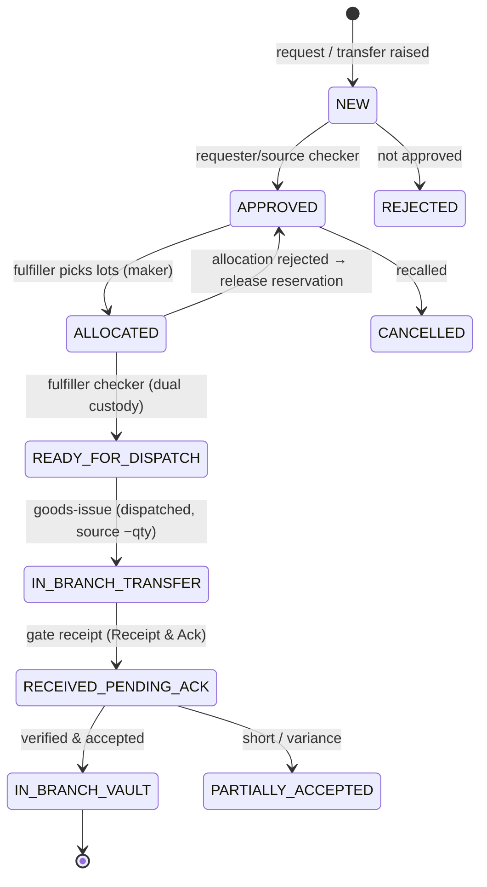

Stock-unit layer (conservation):

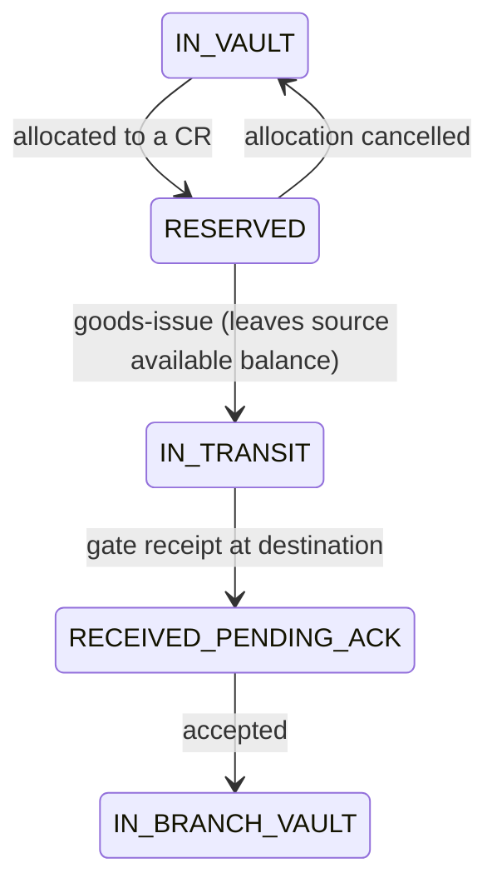

### M.5 End-to-end (pull example — Pune requests 500 from Delhi)

```mermaid
sequenceDiagram
  actor RM as Pune maker
  actor RC as Pune branch head (checker)
  actor FM as Delhi vault officer (allocator)
  actor FC as Delhi checker (dual custody)
  participant S as CMS / CIM
  participant RA as Receipt & Ack (Pune)
  RM->>S: Raise Request Cards CR-2026-0501 (500 Visa Platinum)
  S-->>RM: status NEW
  RC->>S: Approve → APPROVED; routed to Delhi
  FM->>S: Search Delhi stock by product → lots (Job / SR / range / avail)
  FM->>S: Allocate 250 (Lot A) + 250 (Lot B) → RESERVED
  S-->>FM: status ALLOCATED
  FC->>S: Approve dispatch (dual custody) → READY_FOR_DISPATCH
  FC->>S: Goods-issue + key shipment (AWB / carton / seal / ETA)
  S-->>FC: IN_BRANCH_TRANSFER · stock IN_TRANSIT · Delhi available −500
  Note over RA: CR-2026-0501 now appears in Pune's inbound worklist
  RA->>S: Receive (Stage-1) + Verify (Stage-2) by CR
  S-->>RA: IN_BRANCH_VAULT · Pune available +500
```

### M.6 Wireframe — Branch Transfer Order worklist

```
┌ Branch Transfer Order ──────────────────────────────────────────────────────────┐
│ [ My requests ] [ To fulfil ] [ Dispatched / in transit ]      [ + New request ] │
│ Type: (•)All ( )Request cards ( )Transfer cards    Branch:[All ▼]                │
│ ┌──────────────────────────────────────────────────────────────────────────────┐│
│ │ CR            Type      From→To           Product     Qty  Status      Action  ││
│ │ CR-2026-0501  Request   Delhi→Pune Camp   Visa Plat   500  Approved    [Allocate]│
│ │ CR-2026-0498  Transfer  Vault→Bengaluru   DEB-CLS     300  Allocated   [Dispatch]│
│ │ CR-2026-0312  Transfer  Vault→Pune Hinj.  DEB-CLS     300  In transfer [Track]   │
│ └──────────────────────────────────────────────────────────────────────────────┘│
│  action by status: Approved→[Allocate] · Allocated→[Approve & Dispatch] ·         │
│                    In transfer→[Track] (receive happens in Receipt & Ack)         │
└──────────────────────────────────────────────────────────────────────────────────┘
```

### M.7 Edge cases

| # | Edge case | Handling |
|---|---|---|
| 1 | **Insufficient stock** (available < requested) | Partial allocation + **backorder** for the shortfall, or reject with reason |
| 2 | **Allocation spans lots** | Multi-lot pick; preserve per-lot provenance (Job/SR) on each allocated range |
| 3 | **Reserved stock** | Cannot be allocated to another CR or issued at source |
| 4 | **Cancel / recall before dispatch** | Release the reservation back to `IN_VAULT` |
| 5 | **FIFO override** | Allowed but **logged with reason** (e.g., near-expiry lot prioritised) |
| 6 | **Wrong / unavailable product** | Can't fulfil — request rejected or routed to another fulfiller |
| 7 | **In-transit overdue** | Escalation exception (reuses In-transit screen); two-sided reconciliation |
| 8 | **Partial receipt at destination** | Handled by Receipt & Ack (short → discrepancy, CR line stays open) |
| 9 | **Branch ↔ branch (non-HQ)** | Same flow; the fulfiller is a peer branch instead of HQ |
| 10 | **Maker = checker** at either end | System-blocked (SoD) |
| 11 | **Transfer Cards (push)** | Skips the requisition leg — source raises `NEW` directly to a destination |

### M.8 Data model & dummy data (deterministic, in-memory)

```text
TRANSFER_ORDERS (CR) = [
  { cr:"CR-2026-0501", type:"REQUEST_CARDS", mode:"PULL", product:"DEB-PLT",  // Visa Platinum
    fromBranch:"DEL01" (fulfiller), toBranch:"PUN01" (destination), requestedQty:500,
    status:"APPROVED", reqMaker:"A. Kulkarni", reqChecker:"Pune BM",
    allocations:[],  shipment:null, createdAt:"27 Jun 2026" },
  { cr:"CR-2026-0498", type:"TRANSFER_CARDS", mode:"PUSH", product:"DEB-CLS",
    fromBranch:"VAULT", toBranch:"BLR01", requestedQty:300, status:"ALLOCATED",
    allocations:[{lot:"LOT-V1", jobId:"3150", sr:"SR-559900012", from:"KIT-50000", to:"KIT-50299", qty:300}], … },
]

BRANCH_LOTS = [   // fulfiller's on-hand stock, FIFO by recd
  { lot:"LOT-A", branch:"DEL01", product:"DEB-PLT", jobId:"3201", sr:"SR-560011001", from:"KIT-90001", to:"KIT-90250", available:250, recd:"02 May 2026" },
  { lot:"LOT-B", branch:"DEL01", product:"DEB-PLT", jobId:"3266", sr:"SR-560022040", from:"KIT-91000", to:"KIT-91399", available:400, recd:"20 May 2026" },
  { lot:"LOT-C", branch:"DEL01", product:"DEB-PLT", jobId:"3299", sr:"SR-560033075", from:"KIT-92000", to:"KIT-92099", available:100, recd:"05 Jun 2026" },
]
```

> **Worked example.** `CR-2026-0501` — Pune Camp requests **500 Visa Platinum**; Pune BM approves. Delhi allocates **250 from Lot A** (`KIT-90001–90250`, full) + **250 from Lot B** (`KIT-91000–91249`, partial) → `RESERVED`. Delhi checker approves dispatch; goods-issue keys **AWB DEL-PUN-5521 / CTN-101 / SEAL-101** and Delhi's available Platinum drops by 500. The CR (`IN_BRANCH_TRANSFER`) **auto-appears in Pune Camp's Receipt & Ack inbound worklist** by CR number, where it's received and vaulted — closing the loop.

### M.9 UX integration

- **Evolve the existing "Transfers" nav item into a "Branch Transfer Order" workbench** with tabs **My requests / To fulfil / Dispatched** and a **+ New request** (Request Cards | Transfer Cards) action. Actions per row: **Allocate** (lot picking) → **Approve & Dispatch** (dual custody + shipment details).
- **On dispatch, the CR creates a `TRANSFER`-source Expected Receipt** at the destination → it flows straight into the **already-built Receipt & Acknowledgement** worklist (searchable by CR). One CR, two halves, one source of truth.
- Reuse primitives, `addException`/`toast`, the In-transit screen for tracking, and the same maker-checker/SoD patterns.

### M.10 Alignment & build phasing (after review)

- **Maps to** `cardInventoryRequirement.md` §8.5 (branch transfers) and §11 Flow K; the CR ties to **Part E** (receipt) and reuses the **Receipt & Ack** screen for the inbound leg.
- **Build phases:** (1) `TRANSFER_ORDERS` + `BRANCH_LOTS` data + helpers in `src/lib/transfers.js`; (2) `BranchTransferOrder.jsx` worklist + Request-Cards form; (3) allocation/picking modal (FIFO, multi-lot, reserve); (4) dispatch modal (dual-custody approve + shipment details → goods-issue) that **emits a TRANSFER Expected Receipt**; (5) wire to Receipt & Ack; (6) update `cardInventoryRequirement.md` (Flow K enhancement, §8.5, new states).

---

## 15. Improvements, suggestions & my comments

**On the core design**
1. **Generate Expected Receipts at batch time** — this is the single most important recommendation. It decouples receipt from vendor capability and makes **Job Exec ID + Branch** a reliable key. Build the demo around this.
2. **Mandate "Job Exec ID on the cover letter & carton label" in the vendor SOW.** Costs the vendor nothing (it's in the file header) and guarantees the receipt key even for the lowest-tech vendor.
3. **Treat ASN as an enhancement, never a dependency.** Support API + SFTP/EDI-856 + portal + manual. When present, ASN auto-matches expected receipts and enables **scan-to-receive** (QR/2D barcode on cartons).
4. **Unify vendor + transfer under one Inbound model** with a `source` discriminator. One worklist, one two-stage flow, one discrepancy register — far less UI and fewer bugs than two parallel paths.

**On controls**
5. **Enforce segregation of duties** (Stage-1 receiver ≠ Stage-2 verifier/checker) and **dual custody** at Stage 2 — both are PCI Card Production expectations and cheap to demo.
6. **Latent-discrepancy window** — let Stage-1 acknowledgement be "subject to verification" so post-GRN shortages remain claimable.
7. **Blind-count toggle** at Stage 2 for high-value lots (hide expected qty).
8. **Conserve serials end-to-end on transfers** — reserve/decrement at source on CR dispatch; the receiver GRN is the only thing that re-creates the stock. Prevents double-issue.

**On discrepancies**
9. **Don't silo discrepancies** — make each one spawn/link an **Exception** (existing engine) so SLA, escalation and reporting come for free.
10. **Capture variance at SR/lot grain**, not just consignment — the brief explicitly needs "which lot/SR has the issue."

**On product/UX**
11. **KPIs worth surfacing:** GRN turnaround (dispatch→vault), discrepancy rate by vendor & by branch, ack-SLA breaches, % received-pending-ack aging. These also feed vendor SLA scorecards (already in the doc).
12. **PIN mailer** stays a separate consignment with its own reconciliation and `MISSING_PIN_MAILER` reason (personalised programs).
13. **Modularisation:** the main file is ~2,100 lines. I suggest extracting this feature into `src/components/ReceiptAck.jsx` + pure helpers in `src/lib/receipts.js`. It keeps the demo maintainable and mirrors what we did for `forecast.js`/`demandSeries.js`. *(Your call — I can also keep it inline to match the current single-file style.)*

**On personalised (Part L) — my comments**
14. **One component, one `cardClass` switch** — don't fork a second screen; branch only the Stage-2 rendering. Keeps the acknowledge menu unified, as you asked.
15. **Reissue is the heart of personalised.** A missing/damaged named card is *not* "short by N" — it's "customer X has no card." Auto-raise a **reissue SR** and surface it prominently; this is the single biggest behavioural difference from pregen.
16. **Accept-into-collection, not vault.** Wire Stage-2 accept to the **existing Collection register** so the last mile (reminders, KYC handover, unclaimed → destroy) is reused, not rebuilt.
17. **PIN gates *handover*, not *vaulting*.** Let cards reach `AWAITING_COLLECTION` even when PIN mailers are short; block only the customer handover. This avoids stranding good cards over a PIN-stream hiccup.
18. **Card-by-card is slow at 500/day** — default Stage-2 to **"mark all present, then flag exceptions,"** and reuse the same future **scan hook** as pregen so the custodian only touches the exceptions.

**On branch transfer (Part M) — my comments**
19. **Reserve-on-allocation is the single most important fix** to the current flow — without it the same serials can be allocated twice or issued at source while a transfer is pending.
20. **Maker-checker at *both* ends + dual custody on the vault-out.** The fulfiller's dispatch is as sensitive as the requester's approval; don't leave it single-person.
21. **One CR = two halves.** The transfer-order (out) and the GRN (in) are the same CR — model it once and let dispatch *emit* the destination's Expected Receipt, rather than building a parallel inbound path.
22. **Internal shipment update is always available** — the dispatching branch keys AWB/seal/ranges itself, so transfer receipts are richer than vendor receipts and need no ASN fallback.
23. **FIFO by default, override logged.** Suggest the oldest lots first (rotation/expiry), but allow a reasoned override — and keep per-lot provenance on every allocated range so trace/aging survive the hop.
24. **Partial fulfilment + backorder** beats all-or-nothing — let a fulfiller send what they have and keep the shortfall open, so a stock-out branch isn't blocked on a single full fill.

**Decisions (confirmed 27 Jun 2026)**
- **A. ✅ Yes** — surface explicit `Partially Accepted` and `Quarantined` sub-states in the UI (needed for real edge cases).
- **B. Keyboard search now; scan-to-receive (QR/barcode) later.** Build the tiered keyboard search (Job + Branch / ASN / CR); leave a clean hook for a future scan facility.
- **C. Pregen built; personalised now designed (Part L).** Pregen vendor + transfer is built and shipped. Personalised card-by-card acknowledgement is fully designed in **Part L** (same menu, card-by-card verify, separate PIN-mailer reconciliation, accept → collection register, reissue on missing/damaged) — ready to build on your sign-off.
- **D. Modularise.** New code in `src/components/ReceiptAck.jsx` + `src/components/Discrepancies.jsx`, pure logic/data in `src/lib/receipts.js`; shared UI primitives extracted to `src/components/ui.jsx`.
- **E. Separate top-level nav item** for the Discrepancy register (not a tab), with links to/from Exceptions.

---

---

## 16. Glossary (key terms)

Formal one-liners for the terms used throughout this plan:

- **Dual custody** — A control requiring **two authorised officers to be jointly present and both sign off** before high-value stock (e.g., a card vault) can be opened, accepted, or moved; neither can act alone.
- **ASN — Advance Shipping Notice** (a.k.a. *Dispatch Advice*) — An **electronic notice the dispatching party sends at/before dispatch** declaring exactly what is being shipped (courier, AWB, ETA, cartons, seals, product, quantity, serial ranges) so the receiver can prepare and pre-match before the physical goods arrive.
- **GRN — Goods Receipt Note** — The **controlled record that turns "a consignment arrived" into "stock verified, accepted, and on our books,"** capturing quantity, condition, discrepancies, who received it, and the acceptance decision.
- **EDI 856** — The **ANSI X12 electronic-data-interchange message format used to transmit an ASN** (the EDIFACT equivalent is *DESADV*); hierarchical as **Shipment → Order → Pack → Item**.
- **Maker–checker** — A four-eyes control where one user initiates an action and a **different** authorised user approves it.
- **Segregation of duties (SoD)** — Conflicting responsibilities (here: Stage-1 receiver vs Stage-2 verifier/checker) must be held by **different** people.
- **Expected Receipt (Inbound Manifest)** — A system-generated "what's coming" record created at batch time per *Job × Branch × Product*, listing the SRs, expected quantity and serial range — the demand side a receipt is matched against.
- **SR — Service Request** — One approved card-order request; the grain at which quantity, product and serial range are tracked.
- **Job Execution ID** — The EOD-batch run identifier stamped into every embossing-file header; the **common thread** used as the primary receipt search key.
- **CR — Change Request** — The unique identifier for an inter-branch transfer; the receipt search key for the transfer medium.
- **Card class** — Whether a receipt is `PREGEN` (fungible, count-verified, → vault) or `PERSONALISED` (named, card-by-card-verified, → collection). One discriminator drives the differences in Part L.
- **Card-by-card verification** — Personalised Stage-2: every **named** card (Card ID / masked PAN / customer) is individually ticked against the manifest — not a range + count.
- **PIN mailer** — The printed PIN carrier for a personalised card, dispatched as a **separate consignment** in **separate custody** (card and PIN never travel/handed over together).
- **Green PIN** — Customer sets/resets the PIN via ATM / IVR / app, so **no physical PIN mailer** is produced; the mailer reconciliation step is skipped.
- **AWAITING_COLLECTION** — The state an accepted personalised card enters (a *named register*, the Collection screen / Flow F) — it is **not** issuable vault stock.
- **Reissue SR** — A fresh Service Request automatically raised when a named card is missing / damaged / wrong, because a personalised card **cannot be substituted** from a pool.
- **Branch Transfer Order** — The document/menu for moving cards between locations; it carries the **CR** through request → allocate → dispatch → receipt.
- **Request Cards** *(pull)* — A branch-initiated request for stock; a fulfiller allocates and ships against it.
- **Transfer Cards** *(push)* — An HQ/source-initiated transfer that sends stock directly to a destination (no requisition leg).
- **Allocation** — The fulfiller's pick of specific serial ranges (across one or more **lots**) to satisfy a transfer, FIFO-suggested.
- **Reservation** — Stock allocated to a CR but not yet dispatched; ring-fenced so it can't be issued or re-allocated elsewhere.
- **Goods-issue** — The dispatch posting that moves reserved stock to `IN_TRANSIT` and **decrements the source's available balance**.
- **Lot** — A holding of stock identified by **Job ID + SR + serial range + on-hand qty** at a branch; the unit allocation picks from.
- **IBT (3-leg transfer)** — Requisition → IBT-Out (dispatch) → IBT-In (receipt) — the standard inter-branch transfer shape.
- **Backorder** — The unfulfilled shortfall when available stock is less than requested; kept open for a later fill.

---

*End of plan — Receipt & Acknowledgement + Branch Transfer Order, v0.4 (for review). Scope: pregen + personalised acknowledgement (built); Branch Transfer Order design (Part M).*
